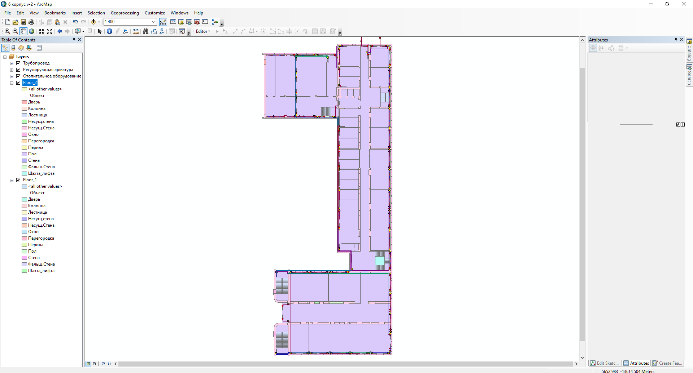
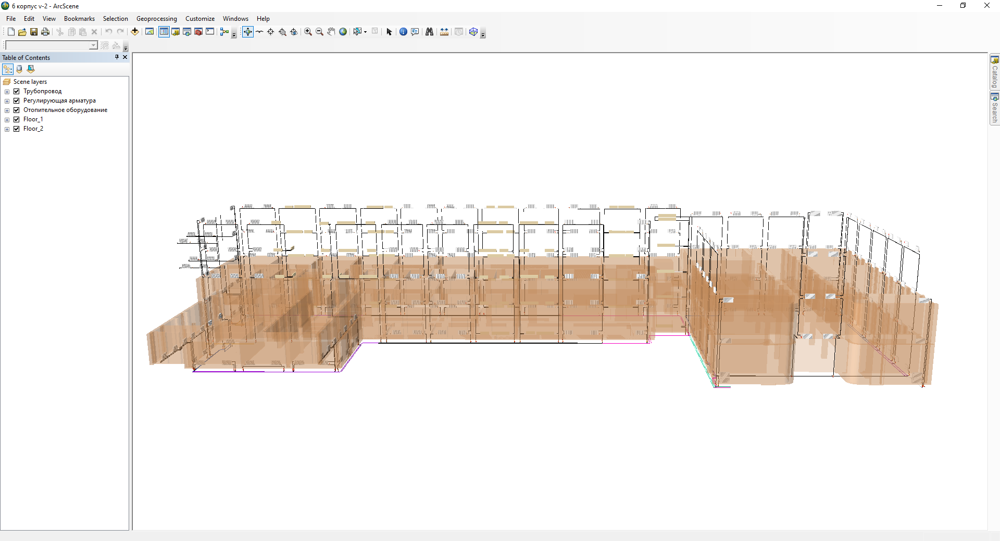
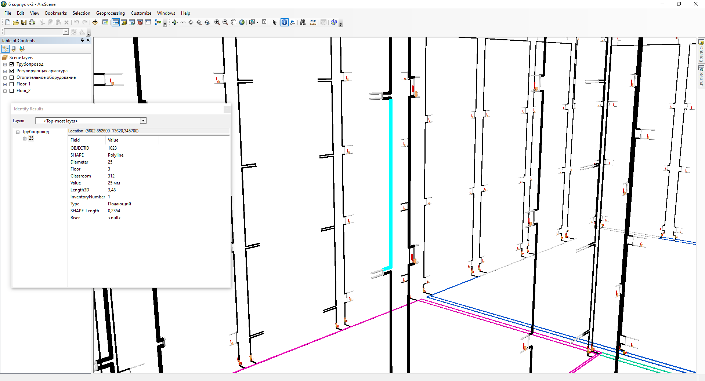
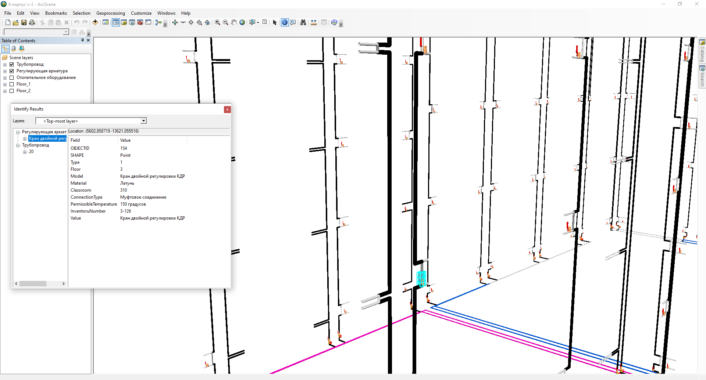
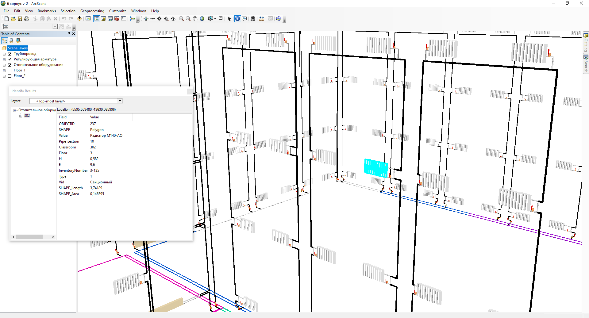
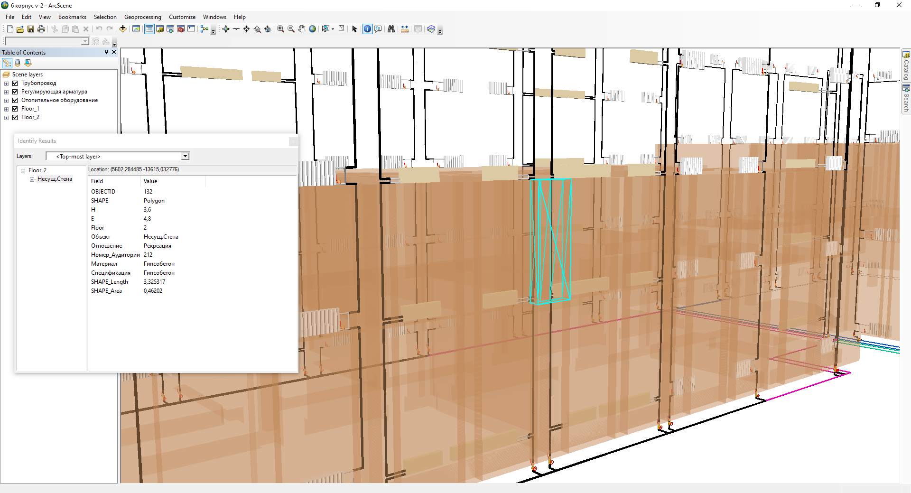

# heating-system
# Разработка цифрового двойника системы отопления учебного корпуса «УУНиТ» на базе ГИС–технологий

Цифровой двойник, созданный при помощи ГИС-технологий, может быть использован для сбора и анализа данных об энергопотреблении и эффективности системы отопления и прочих инженерных коммуникациях. Это позволит повысить эффективность процесса принятия решений, как минимум за счет представления в наглядной, легко воспринимаемой форме разнотипной, в том числе, пространственной информации. Процесс создания цифровых двойников на базе ГИС-технологий состоит из нескольких этапов основным из которых является подготовка векторных данных и их обработка.

Рисунок 1 – Оцифрованный 2 этаж

Рисунок 2 – Трехмерное представление корпуса и системы теплоснабжения

Рисунок 3 – Таблица атрибутов для трубопровода

Рисунок 4 – Таблица атрибутов для запорной арматуры

Рисунок 4 – Таблица атрибутов для отопительного оборудования

Рисунок 4 – Таблица атрибутов для объекта здания
